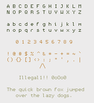

# SushiFont

Sushifont is a modification of
[uushi](https://github.com/phallus/fonts). It is small and
(subjectively) readable. It offers a few industrial hazard/warning
glyphs as well.

### Reprtoire

 

### Code

 

### Hazard Signs

Various industrial hazard symbols accessed through unicode U2460 -
U246B.
